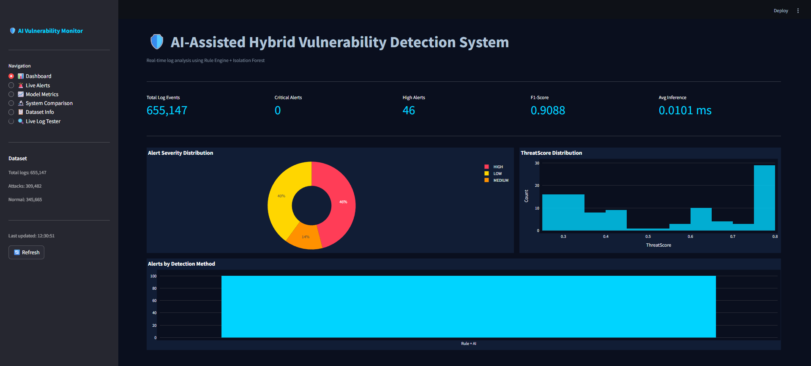
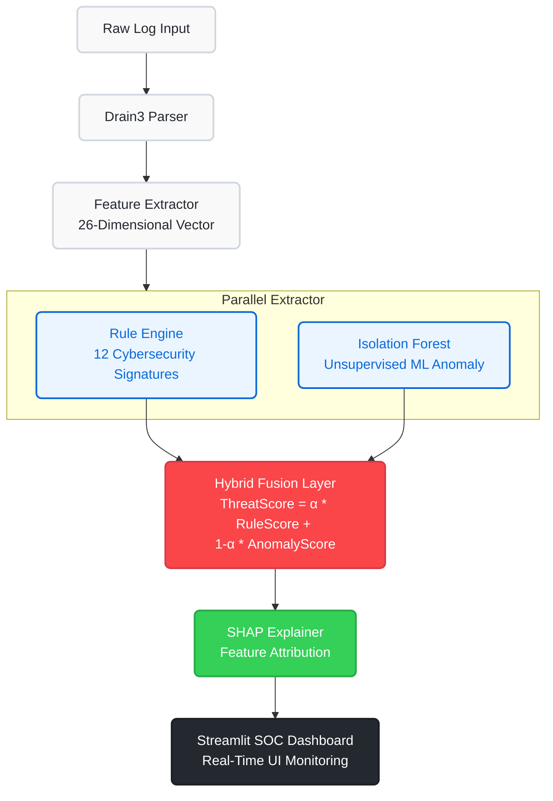
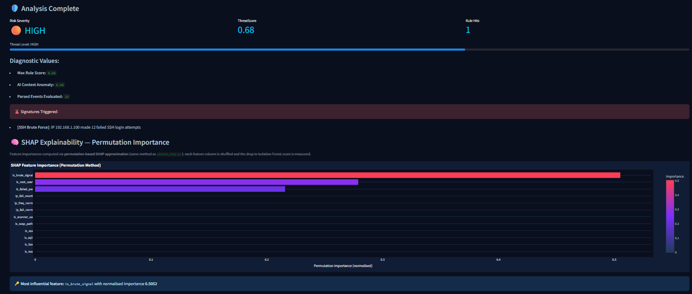

<div align="center">
  <h1>🛡️ AI-Assisted Hybrid Vulnerability Detection System</h1>
  <p><strong>A Real-Time, Explainable Threat Detection Engine for Security Operations Centers (SOCs)</strong></p>
  
  [](https://ai-hybrid-ids-mq6frlreyokd3wdtsnncy5.streamlit.app/)
  
  <br />
  <!-- Drop your dashboard screenshot inside the assets/ folder and name it dashboard_screenshot.png -->
  
</div>

<br />

## 📖 Research Context & Overview

### The Base Paper & Problem
Recent state-of-the-art anomaly detection systems in cybersecurity heavily rely on Deep Learning models like **DeepLog** (LSTM) or **LogBERT**. While highly effective at identifying zero-day anomalies, these base architectures suffer from two critical flaws when deployed in real-world Security Operations Centers (SOCs):
1. **The "Black Box" Problem:** Analysts are given an anomaly score but no explanation as to *why* the sequence was flagged.
2. **Alert Fatigue:** Pure unsupervised learning over low-context logs results in prohibitively high False Positive Rates (FPR).

### Our Novel Addition
This project completely rearchitects the intrusion detection pipeline. Instead of relying purely on deep learning, we propose an **Optimized Hybrid Pipeline**. It runs in parallel:
- A deterministic **Cybersecurity Rule Engine** (12 signatures mimicking tools like Snort).
- An unsupervised **Isolation Forest (AI)** array.

Furthermore, we solve the Black Box problem by integrating **SHAP (Shapley Additive exPlanations)** directly into the real-time inference pipeline, allowing the system to mathematically reverse-engineer its own AI decisions and present them visually to security analysts.

### The Hybrid Fusion Formula
To bridge deterministic security rules with probabilistic AI, we developed a weighted scalar fusion layer. The outputs of both parallel engines are normalized and combined using the following formula:

> **$\text{ThreatScore} = \alpha \times \text{RuleScore} + (1 - \alpha) \times \text{AnomalyScore}$**

Where `α` (Alpha) is a hyperparameter determining the trust weight assigned to hard rules versus AI intuition (calibrated to `0.55` for OpenSSH).

---

## 🏗️ System Architecture

The pipeline processes raw system logs through a 5-layer architecture before rendering them in a real-time SOC dashboard.



---

## 🚀 Features

1. **Live Log Tester UI:** Paste raw SSH, Apache, HDFS, or Linux logs into the dashboard to parse and score them in real-time.
2. **SHAP Waterfall Charts:** Instantly see which mathematical features (e.g., `ip_fail_count`, `is_invalid_user`) contributed most to the AI's anomaly score.
3. **Multi-Dataset Support:** Pre-configured extraction pipelines for OpenSSH, HDFS, BGL, and Thunderbird supercomputer logs.

<!-- Drop your SHAP chart inside the assets/ folder and name it shap_chart.png -->
<div align="center">
  
</div>

4. **Automated Research Pipelines:** Includes scripts for 5-Fold Cross Validation, Alpha Parameter Sensitivity sweeping, and comparative ablation against LSTM baselines.

---

## 💻 Local Installation & Setup

Ensure you have Python 3.9+ installed on your system. 

**1. Clone the repository**
```bash
git clone https://github.com/Ssr446/AI-Hybrid-IDS.git
cd AI-Hybrid-IDS
```

**2. Create a virtual environment**
```bash
python -m venv .venv
# Activate on Windows:
.venv\Scripts\activate
# Activate on Mac/Linux:
source .venv/bin/activate
```

**3. Install Dependencies**
```bash
pip install -r requirements.txt
```

**4. Train the ML Model**
Before running the dashboard, you must train the Isolation Forest model on normal behavior.
```bash
python train.py
```

**5. Launch the SOC Dashboard**
```bash
streamlit run dashboard/app.py
```
*Navigate to `http://localhost:8501` to view the active defense dashboard!*

---

## 🧪 Running the Evaluation Pipelines

To reproduce the research metrics, cross-validations, and ablation studies, run the master orchestrator:

```bash
python run_all_phases.py
```
This will automatically generate high-resolution PNG charts in the `results/plots/` directory and compile a CSV table comparing this hybrid approach against DeepLog and LogBERT.

---

## 🛠️ Built With

*   **[Streamlit](https://streamlit.io/)** - For the interactive SOC Dashboard.
*   **[Scikit-Learn](https://scikit-learn.org/)** - For the Isolation Forest implementation.
*   **[Drain3](https://github.com/logpai/Drain3)** - For automated log templating and parsing.
*   **[Plotly](https://plotly.com/) & [Seaborn](https://seaborn.pydata.org/)** - For real-time explainability visualizations and metric plots.

---
*Developed as a B.Tech Minor Project.*
