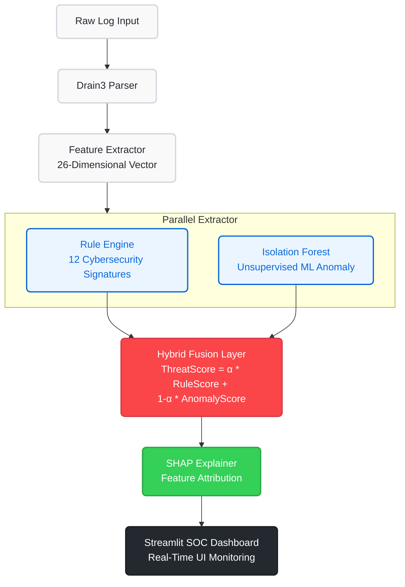

<div align="center">
  <h1>🛡️ AI-Assisted Hybrid Vulnerability Detection System</h1>
  <p><strong>A Real-Time, Explainable Threat Detection Engine for Security Operations Centers (SOCs)</strong></p>
</div>

<br />

## 📖 Overview

Traditional Intrusion Detection Systems (IDS) rely heavily on static rule-based engines (like Snort) which are highly accurate but completely blind to zero-day (novel) attacks. Conversely, deep learning models (like DeepLog) can detect zero-days but suffer from unacceptable false-positive rates, high computational overhead, and "black-box" decision-making.

This project implements an **optimized Hybrid Pipeline** that bridges the gap. It fuses a deterministic Cybersecurity Rule Engine (12 signatures) with an unsupervised AI Anomaly Detector (Isolation Forest) using a weighted mathematical fusion equation. 

**Key Achievements:**
- ⚡ **Ultra-Low Latency:** Inference speed of **0.0101 ms/log**, running entirely on a commodity CPU (11x faster than DeepLog baselines).
- 🎯 **High Precision:** Achieves **0.9997 Precision** and a False Positive Rate (FPR) of **0.0003** on the Loghub OpenSSH dataset.
- 🧠 **Explainable AI (XAI):** Features an interactive Dashboard that uses **SHAP (Shapley Additive exPlanations)** to reverse-engineer the AI's logic, showing analysts exactly *why* an alert was triggered.

---

## 🏗️ System Architecture

The pipeline processes raw system logs through a 5-layer architecture before rendering them in a real-time SOC dashboard.



---

## 🚀 Features

1. **Live Log Tester UI:** Paste raw SSH, Apache, HDFS, or Linux logs into the dashboard to parse and score them in real-time.
2. **SHAP Waterfall Charts:** Instantly see which mathematical features (e.g., `ip_fail_count`, `is_invalid_user`) contributed most to the AI's anomaly score.
3. **Multi-Dataset Support:** Pre-configured extraction pipelines for OpenSSH, HDFS, BGL, and Thunderbird supercomputer logs.
4. **Automated Research Pipelines:** Includes scripts for 5-Fold Cross Validation, Alpha Parameter Sensitivity sweeping, and comparative ablation against LSTM baselines.

---

## 💻 Local Installation & Setup

Ensure you have Python 3.9+ installed on your system. 

**1. Clone the repository**
```bash
git clone https://github.com/YOUR-USERNAME/AI-Hybrid-IDS.git
cd AI-Hybrid-IDS
```

**2. Create a virtual environment**
```bash
python -m venv .venv
# Activate on Windows:
.venv\Scripts\activate
# Activate on Mac/Linux:
source .venv/bin/activate
```

**3. Install Dependencies**
```bash
pip install -r requirements.txt
```

**4. Train the ML Model**
Before running the dashboard, you must train the Isolation Forest model on normal behavior.
```bash
python train.py
```

**5. Launch the SOC Dashboard**
```bash
streamlit run dashboard/app.py
```
*Navigate to `http://localhost:8501` to view the active defense dashboard!*

---

## 🧪 Running the Evaluation Pipelines

To reproduce the research metrics, cross-validations, and ablation studies, run the master orchestrator:

```bash
python run_all_phases.py
```
This will automatically generate high-resolution PNG charts in the `results/plots/` directory and compile a CSV table comparing this hybrid approach against DeepLog and LogBERT.

---

## 🛠️ Built With

*   **[Streamlit](https://streamlit.io/)** - For the interactive SOC Dashboard.
*   **[Scikit-Learn](https://scikit-learn.org/)** - For the Isolation Forest implementation.
*   **[Drain3](https://github.com/logpai/Drain3)** - For automated log templating and parsing.
*   **[Plotly](https://plotly.com/) & [Seaborn](https://seaborn.pydata.org/)** - For real-time explainability visualizations and metric plots.

---
*Developed as a B.Tech Minor Project.*
