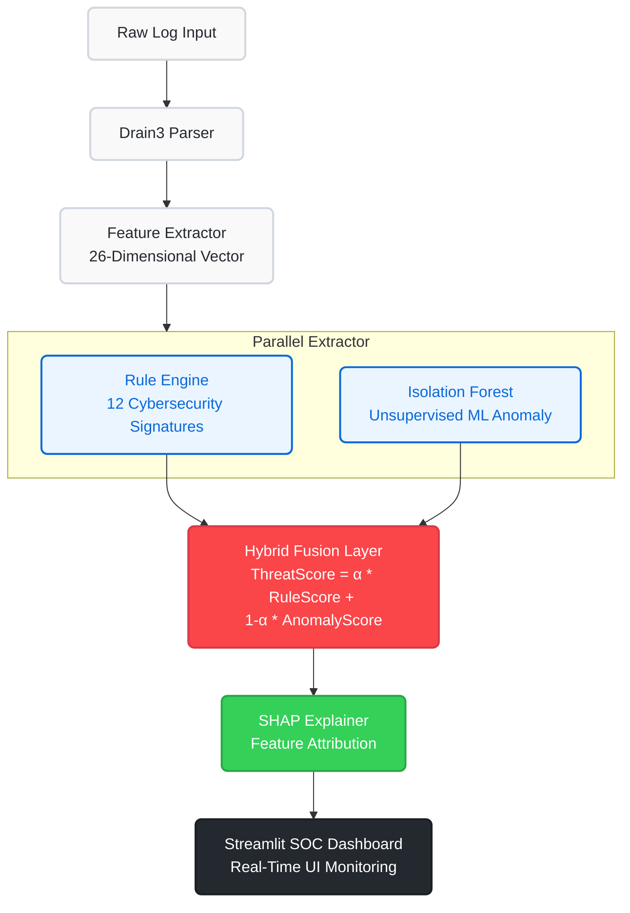
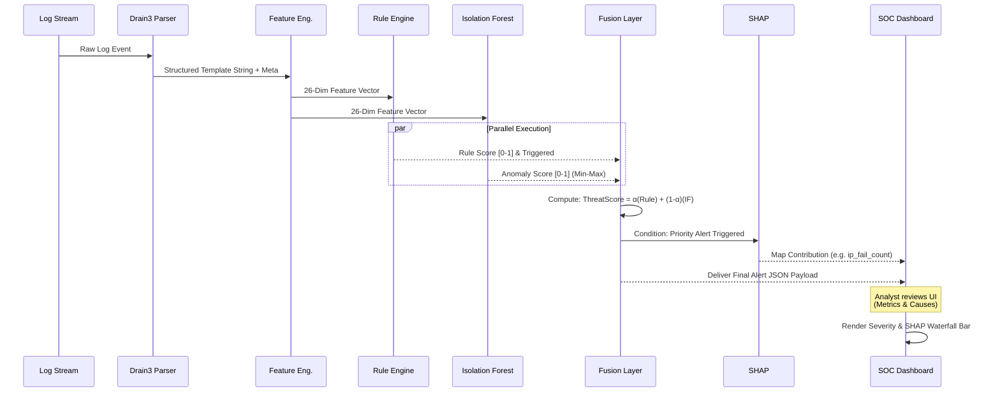

# System Architecture and Flow Diagrams

> **Note:** If you are viewing this in VS Code, right-click and "Open Preview" or use the Mermaid Markdown extension. You can also copy and paste these blocks into 👉 [Mermaid Live Editor](https://mermaid.live/) to instantly download high-quality PNGs or SVGs to paste into your Word documents!

***

### Fig 3.1: System Architecture Block Diagram (5-Layer Pipeline)

***

### Fig 4.1: Internal Execution Sequence Diagram

